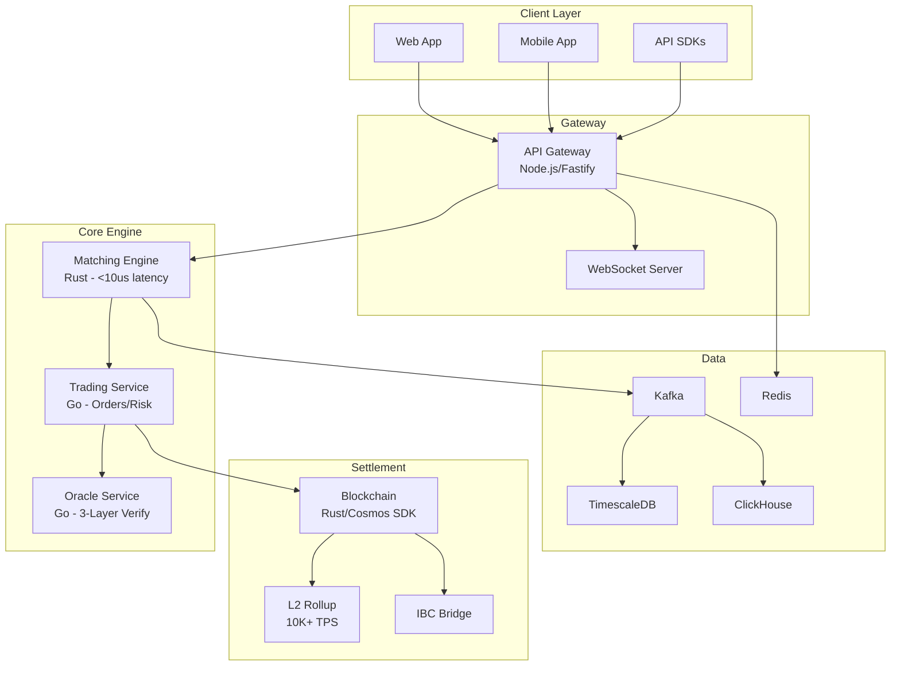

# ComputeCoin (算力币)

[](https://github.com/anthropics/AIComputeCoin/actions)
[](https://opensource.org/licenses/MIT)
[](https://github.com/anthropics/AIComputeCoin/releases)

**The world's first compute power financial exchange** - enabling price discovery, liquid trading, and derivatives for standardized compute resources.

---

## Overview

ComputeCoin transforms the fragmented $500B+ compute market into a transparent, liquid financial exchange. By standardizing compute into tradeable units (CU), we enable futures, options, and structured products for GPU computation - the fastest-growing commodity in history.

```
1 CU (Compute Unit) = 1 TFLOPS x 1 hour of FP16 computation
```

## Architecture



## Key Innovations

| Innovation | Description |
|-----------|-------------|
| **CU Standardization** | Universal compute unit (1 TFLOPS-hr FP16) enabling apples-to-apples comparison and trading |
| **Proof of Compute (PoC)** | Novel consensus where miners earn by providing real, verified computation - not wasting energy |
| **Compute Derivatives** | First-ever futures, options, and swaps for standardized compute power |
| **3-Layer Oracle** | Hardware attestation (TEE) + real-time benchmarks + economic staking for robust verification |
| **Ultra-Low Latency** | Rust matching engine targeting <10 microsecond order matching with lock-free data structures |

## Technology Stack

| Component | Technology | Purpose |
|-----------|-----------|---------|
| Matching Engine | Rust | Lock-free order book, price-time priority |
| API Gateway | Node.js / Fastify | REST API, WebSocket, auth, rate limiting |
| Trading Service | Go | Order lifecycle, risk engine, settlement |
| Oracle Service | Go | Compute verification, node management |
| Blockchain | Rust (Cosmos SDK) | CC token, PoC consensus, governance |
| Web App | Next.js / React | Trading UI, portfolio, analytics |
| Shared | Protocol Buffers | Type-safe inter-service communication |
| Streaming | Apache Kafka | Event sourcing, real-time data |
| Time-Series | TimescaleDB | OHLCV candles, trade history |
| Analytics | ClickHouse | Reporting, backtesting |
| Cache | Redis | Sessions, rate limiting, hot data |
| Infrastructure | Kubernetes | Multi-region, auto-scaling |

## Quick Start

### Prerequisites

- Rust 1.92+
- Go 1.25+
- Node.js 22+ with pnpm
- Docker and Docker Compose
- Protocol Buffers compiler (protoc)

### Setup

```bash
# Clone the repository
git clone https://github.com/anthropics/AIComputeCoin.git
cd AIComputeCoin

# Install dependencies
make setup

# Build all packages
make build

# Run tests
make test

# Start local development environment
docker compose up -d

# Run the full stack
make dev
```

### Build Commands

```bash
make build      # Build all packages
make test       # Run all tests
make lint       # Run all linters
make proto      # Regenerate protobuf types
make coverage   # Run tests with coverage report
make bench      # Run performance benchmarks
```

## Documentation

| Document | Description |
|----------|-------------|
| [Architecture](docs/ARCHITECTURE.md) | System design, component details, data flow |
| [Tokenomics](docs/TOKENOMICS.md) | CC token economics, emission, staking, governance |
| [API Specification](docs/API_SPEC.md) | REST, WebSocket, and gRPC endpoint reference |
| [Contributing](docs/CONTRIBUTING.md) | How to contribute, code standards, PR process |
| [Investor Summary](docs/INVESTOR_DECK.md) | Market opportunity, business model, roadmap |
| [Iteration Plan](docs/ITERATION_PLAN.md) | Phased development plan with milestones |

## Project Structure

```
AIComputeCoin/
├── CLAUDE.md                 # Claude Code configuration
├── Makefile                  # Build orchestration
├── docker-compose.yml        # Local development services
├── docs/                     # Project documentation
├── packages/
│   ├── matching-engine/      # Rust - Order matching (<10us)
│   ├── api-gateway/          # Node.js - REST/WebSocket API
│   ├── trading-service/      # Go - Trading and risk
│   ├── oracle-service/       # Go - Compute verification
│   ├── blockchain/           # Rust - L1 chain and token
│   ├── web-app/              # Next.js - Trading UI
│   └── shared/               # Protobuf definitions
├── .github/                  # CI/CD workflows
└── tests/
    └── e2e/                  # End-to-end tests
```

## Contributing

We welcome contributions! Please read our [Contributing Guide](docs/CONTRIBUTING.md) for details on:

- Development setup
- Code style and conventions
- Pull request process
- Testing requirements

## License

This project is licensed under the MIT License - see the [LICENSE](LICENSE) file for details.

## Community

- **Website:** https://computecoin.io
- **Discord:** https://discord.gg/computecoin
- **Twitter:** https://twitter.com/computecoin
- **Email:** hello@computecoin.io
- **Security:** security@computecoin.io (for vulnerability reports)
