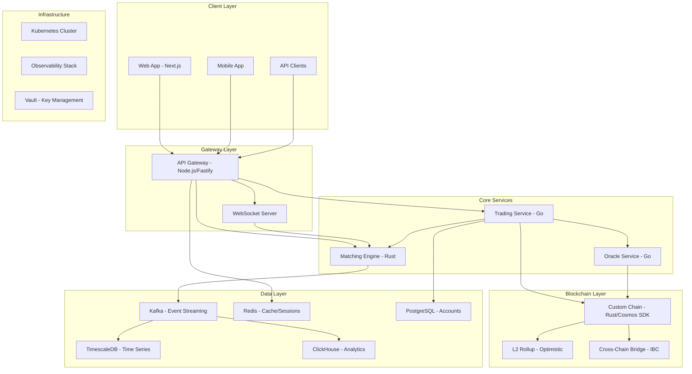

# ComputeCoin Technical Architecture

## System Overview

ComputeCoin is a high-performance compute power financial exchange built as a distributed microservices architecture. The system standardizes compute resources into tradeable units (CU) and provides a full derivatives trading stack.

### Architecture Diagram



## Core Concept: Compute Unit (CU)

### Specification

```
1 CU = 1 TFLOPS x 1 hour of FP16 computation
```

| Property | Value |
|----------|-------|
| Base Unit | 1 TFLOPS-hour (FP16) |
| Precision | 6 decimal places |
| Minimum Tradeable | 0.001 CU |
| Reference Hardware | NVIDIA A100 (312 TFLOPS FP16) = 312 CU/hr |
| Verification | Oracle Service 3-layer attestation |

### CU Conversion Examples

| Hardware | FP16 TFLOPS | CU per Hour |
|----------|-------------|-------------|
| NVIDIA H100 | 990 | 990 |
| NVIDIA A100 | 312 | 312 |
| NVIDIA RTX 4090 | 165 | 165 |
| AMD MI300X | 1307 | 1307 |
| Google TPU v5e | 197 | 197 |

## Component Architecture

### 1. Matching Engine (Rust)

**Purpose:** Ultra-low-latency order matching with price-time priority.

**Design Principles:**
- Lock-free order book using atomic operations and CAS loops
- Price-time priority matching algorithm
- Memory-mapped I/O for persistence
- Zero-copy message passing between threads
- Target latency: <10 microseconds (p99)

**Architecture:**
```
┌─────────────────────────────────────────────┐
│              Matching Engine                  │
├──────────┬──────────┬──────────┬────────────┤
│ Order    │ Order    │ Market   │ Risk       │
│ Gateway  │ Book     │ Data     │ Checks     │
├──────────┴──────────┴──────────┴────────────┤
│           Event Publisher (Kafka)             │
└─────────────────────────────────────────────┘
```

**Key Data Structures:**
- `OrderBook` - Red-black tree per price level, doubly-linked list at each level
- `Order` - Fixed-size struct (128 bytes) for cache-line alignment
- `Trade` - Immutable execution record published to event stream

**Performance Targets:**
| Metric | Target |
|--------|--------|
| Order insert | <5us |
| Order cancel | <3us |
| Match + publish | <10us |
| Throughput | 1M orders/sec |
| Memory per book | <1GB for 10M orders |

### 2. API Gateway (Node.js/Fastify)

**Purpose:** Client-facing HTTP/WebSocket interface with authentication and rate limiting.

**Capabilities:**
- RESTful API (OpenAPI 3.1 documented)
- WebSocket real-time streams (orderbook, trades, klines)
- JWT authentication with refresh token rotation
- API key + HMAC signature for programmatic access
- Tiered rate limiting (public, authenticated, market maker)
- Request validation and sanitization
- Response compression (gzip/brotli)

**Architecture:**
```
┌─────────────────────────────────────────┐
│            API Gateway                   │
├─────────┬─────────┬─────────┬───────────┤
│ Auth    │ Rate    │ Route   │ WebSocket │
│ Module  │ Limiter │ Handler │ Manager   │
├─────────┴─────────┴─────────┴───────────┤
│         gRPC Client Pool                 │
└─────────────────────────────────────────┘
```

**Rate Limiting Tiers:**
| Tier | Requests/sec | WebSocket Connections |
|------|-------------|----------------------|
| Public | 10/s | 1 |
| Authenticated | 50/s | 5 |
| Market Maker | 200/s | 20 |
| Institutional | 500/s | 50 |

### 3. Trading Service (Go)

**Purpose:** Order lifecycle management, position tracking, risk engine, and settlement.

**Responsibilities:**
- Order validation and enrichment
- Position management (open/close/liquidate)
- Margin calculation and maintenance
- Risk engine (pre-trade and real-time)
- Settlement and clearing
- Account balance management
- Trade history and reporting

**Architecture:**
```
┌─────────────────────────────────────────────┐
│             Trading Service                   │
├──────────┬───────────┬──────────┬───────────┤
│ Order    │ Position  │ Risk     │ Settlement│
│ Manager  │ Manager   │ Engine   │ Engine    │
├──────────┴───────────┴──────────┴───────────┤
│          Event Consumer (Kafka)               │
├─────────────────────────────────────────────┤
│          PostgreSQL + Redis                   │
└─────────────────────────────────────────────┘
```

**Risk Controls:**
- Pre-trade: margin check, position limits, price bands
- Real-time: mark-to-market, maintenance margin monitoring
- Circuit breakers: halt trading on extreme moves (>10% in 5min)
- Liquidation engine: progressive liquidation with insurance fund backstop

### 4. Oracle Service (Go)

**Purpose:** Verify and attest compute power provided by nodes in the network.

**3-Layer Verification System:**

```
┌─────────────────────────────────────────┐
│         Oracle Service                   │
├─────────────────────────────────────────┤
│ Layer 1: Hardware Fingerprint (TEE)      │
│   - Trusted Execution Environment        │
│   - GPU serial, firmware hash            │
│   - Hardware attestation certificate     │
├─────────────────────────────────────────┤
│ Layer 2: Real-time Performance           │
│   - Continuous benchmark tasks           │
│   - Random computation challenges        │
│   - Latency and throughput measurement   │
├─────────────────────────────────────────┤
│ Layer 3: Economic Staking                │
│   - CC token stake as collateral         │
│   - Slashing for dishonest behavior      │
│   - Reputation score accumulation        │
└─────────────────────────────────────────┘
```

**Verification Flow:**
1. Provider registers hardware with TEE attestation
2. Oracle assigns random benchmark tasks every epoch (10 min)
3. Results cross-validated by 3+ independent oracle nodes
4. Stake slashed if verification fails (10% per violation)
5. CU rating updated based on verified performance

### 5. Blockchain Layer (Rust - Cosmos SDK Compatible)

**Purpose:** Decentralized settlement, CC token, governance, and Proof of Compute consensus.

**Components:**

| Component | Description |
|-----------|-------------|
| CC Token | Native token, 2.1B supply, deflationary |
| PoC Consensus | Proof of Compute - mine by providing verified compute |
| Staking | Validator and delegator staking |
| Governance | On-chain proposals and voting |
| IBC | Inter-Blockchain Communication for cross-chain |

**Proof of Compute (PoC) Consensus:**
```
Traditional PoW:  Energy --> Hash Puzzles --> Block Reward
ComputeCoin PoC:  Energy --> Useful Compute --> Block Reward + CU Revenue
```

Miners earn rewards by providing verified useful computation rather than solving arbitrary hash puzzles. This aligns economic incentives with real-world value creation.

**Block Parameters:**
| Parameter | Value |
|-----------|-------|
| Block time | 6 seconds |
| Max block size | 4 MB |
| Finality | 2 blocks (~12s) |
| Validators | 100 active set |
| Epoch | 100 blocks (~10 min) |

### 6. L2 Rollup (Optimistic)

**Purpose:** High-throughput settlement for trading operations that don't require immediate finality.

**Design:**
- Optimistic rollup with 7-day challenge period
- Batch trading settlements every 100ms
- Fraud proofs for dispute resolution
- Sequencer with decentralization roadmap
- Data availability on L1

**Performance:**
| Metric | Value |
|--------|-------|
| TPS | 10,000+ |
| Settlement batch | 100ms |
| Finality (optimistic) | 100ms |
| Finality (proven) | 7 days |
| Gas cost reduction | 100x vs L1 |

## Data Pipeline

### Event Streaming (Apache Kafka)

All state changes flow through Kafka as immutable events:

```
Order Events:     order.created, order.matched, order.cancelled
Trade Events:     trade.executed, trade.settled
Market Events:    market.tick, market.depth_update
Account Events:   account.deposit, account.withdrawal, account.transfer
Oracle Events:    oracle.verification, oracle.cu_update
```

**Configuration:**
- Partitioning: by trading pair (ensures ordering per market)
- Replication factor: 3
- Retention: 7 days hot, 90 days cold (S3)
- Compression: LZ4

### Storage Architecture

| Store | Use Case | Data Model |
|-------|----------|------------|
| PostgreSQL | Accounts, orders, positions | Relational |
| TimescaleDB | OHLCV candles, trade history | Time-series |
| ClickHouse | Analytics, reporting, backtesting | Columnar |
| Redis | Sessions, cache, rate limiting | Key-value |
| S3 | Event archive, backups | Object |

## Infrastructure

### Kubernetes Architecture

```
┌─────────────────────────────────────────────────┐
│              Kubernetes Cluster                   │
├────────────┬────────────┬────────────┬──────────┤
│ Namespace: │ Namespace: │ Namespace: │Namespace:│
│ trading    │ blockchain │ data       │ infra    │
├────────────┼────────────┼────────────┼──────────┤
│ ME pods    │ BC nodes   │ Kafka      │Prometheus│
│ GW pods    │ L2 seq     │ TimescaleDB│ Grafana  │
│ TS pods    │ Bridge     │ ClickHouse │ Jaeger   │
│ OS pods    │            │ Redis      │ Vault    │
└────────────┴────────────┴────────────┴──────────┘
```

**Multi-Region Deployment:**
- Primary: US-East (matching engine authority)
- Secondary: EU-West, Asia-Pacific
- Strategy: Active-active for reads, leader-follower for writes
- Failover: Automatic with <30s recovery time

### Observability Stack

| Tool | Purpose |
|------|---------|
| Prometheus | Metrics collection |
| Grafana | Dashboards and alerting |
| Jaeger | Distributed tracing |
| Loki | Log aggregation |
| PagerDuty | Incident management |

**Key Metrics:**
- Order latency (p50, p95, p99)
- Matching engine throughput (orders/sec)
- API response time by endpoint
- WebSocket connection count
- Kafka consumer lag
- Node verification success rate

## Security Architecture

### Defense in Depth

```
Layer 1: Network     - VPC isolation, WAF, DDoS protection
Layer 2: Transport   - mTLS between all services
Layer 3: Application - Input validation, auth, authorization
Layer 4: Data        - Encryption at rest (AES-256), column-level for PII
Layer 5: Operational - Audit logging, anomaly detection, key rotation
```

### Key Management

- HashiCorp Vault for secrets management
- HSM-backed signing keys for blockchain operations
- Automatic key rotation (90-day cycle)
- Multi-signature for treasury operations (3-of-5)
- Emergency key revocation procedure

### Audit Trail

Every sensitive operation generates an immutable audit event:
- Authentication attempts (success/failure)
- Order submissions and modifications
- Withdrawals and transfers
- Configuration changes
- Admin actions

## Key Innovations

### 1. Proof of Compute (PoC)

Unlike Proof of Work which wastes energy on hash puzzles, PoC rewards miners for providing real, verified computation that has actual economic value. Miners contribute to the compute marketplace while securing the network.

### 2. 3-Layer Oracle Verification

Hardware attestation (TEE) + performance benchmarking + economic staking creates a robust verification system that is resistant to spoofing, Sybil attacks, and collusion.

### 3. Compute Derivatives

First-ever derivatives market for standardized compute:
- CU Futures: Lock in future compute prices
- CU Options: Hedge against price volatility
- CU Swaps: Exchange fixed for floating compute rates

### 4. Cross-Chain Settlement

IBC compatibility enables settlement across multiple blockchains, bringing liquidity from Ethereum, Solana, and other ecosystems into the compute marketplace.
